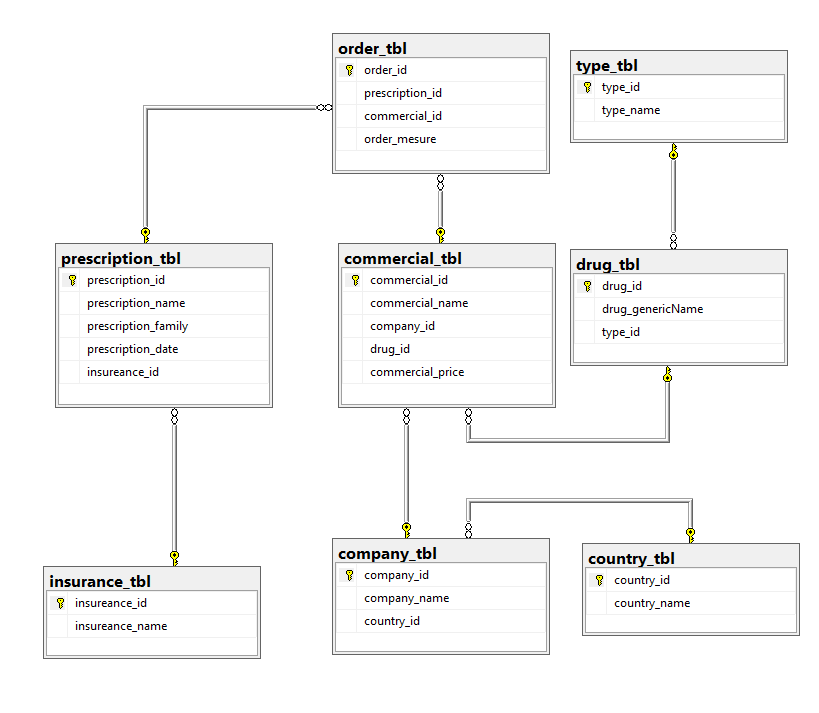
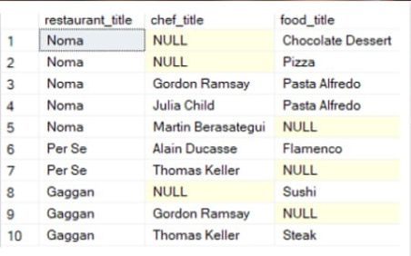

# sqlserver_mft

Hello to Everybody.
This is my answer to the question which had been provided by our <a href="https://www.linkedin.com/in/hani-hani-1793097a/">teacher</a> in <a href="https://www.linkedin.com/company/khanehomran/">MFT institution</a>, which is located in Tehran, IRAN.

The <b>First question</b> is, based on the picture below, create a database; Then pollute the database with data, and then answer the following questions:
1. The number of prescriptions that France has made drugs in it.
2. Name of the insurance company which had over 100 prescriptions in the last year.
3. Create a subprogram to get a company id and return the most expensive drug of that company.
4. Name of the Most Expensive Drug in each category.
5. Without tampering with the actual data in the database, make a report with two columns: the name of the drug and the price, which has a 3% increase.

The <b>Second question</b> which is optional is, Using given Ratatouille database file, for each restaurant, provide a report that includes:
1. Which food is cooked by which chef
2. Which food is cooked but don't have a chef
3. Which chefs don't cook any food

The Boss insists you provide the report in one table with restaurant_title, chef_title, food_title as its columns, like the picture bellow:

# Solutions : 1st Question

First Step : Database Creating
